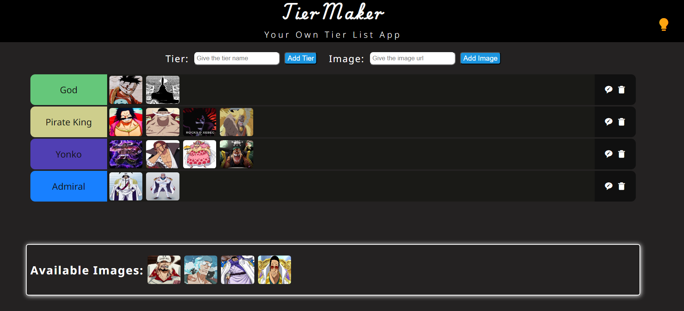
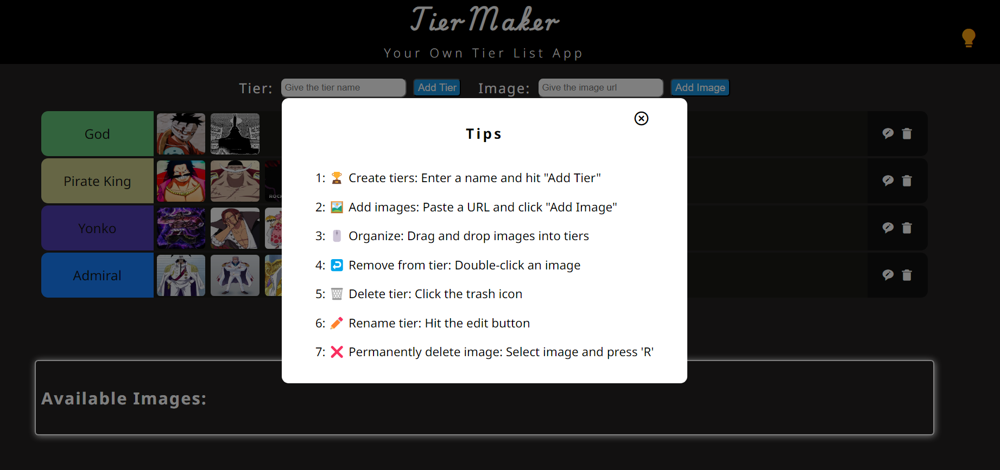

# Tier List Maker

Create, manage, and customize your own tier lists with this interactive web application.

## Screenshots

## Features

- Create custom tier lists with personalized categories
- Drag and drop items to organize your tier list
- Edit tier list names after creation
- Delete unwanted tier lists
- Automatic saving using local storage for easy retrieval
- Tips section accessible by clicking the bulb button, providing instructions for users

## How to Use

1. Open the application in your web browser.
2. Click on "Create New Tier List" to start a new list.
3. Add items to your tier list by typing in the input field and clicking "Add Item".
4. Drag and drop items into the appropriate tiers.
5. Use the "Edit Name" button to change the title of your tier list.
6. Use the "Delete" button to remove unwanted tier lists.

## Technical Details

This project is built using:

- HTML5 for structure
- CSS3 for styling and responsive design
- JavaScript for interactive functionality
- Local Storage API for data persistence

## Future Improvements

- Implement responsive design to ensure optimal user experience across various devices and screen sizes
- Add media queries to adjust layout and element sizes for mobile and tablet views
- Enhance UI elements for better visibility and interaction on mobile devices
